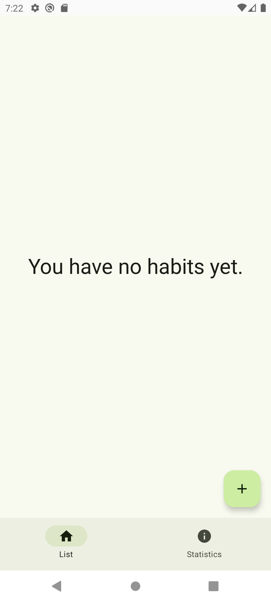
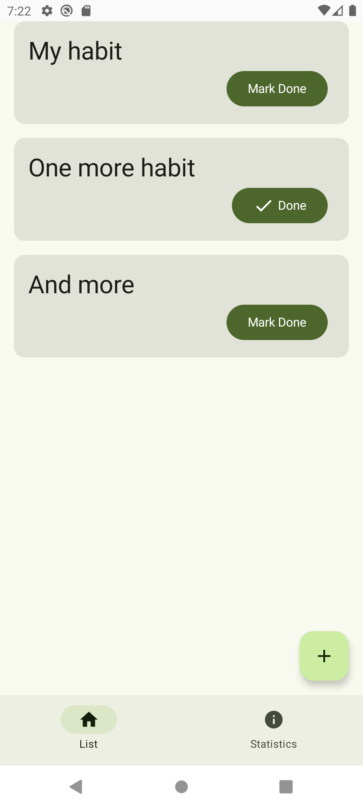
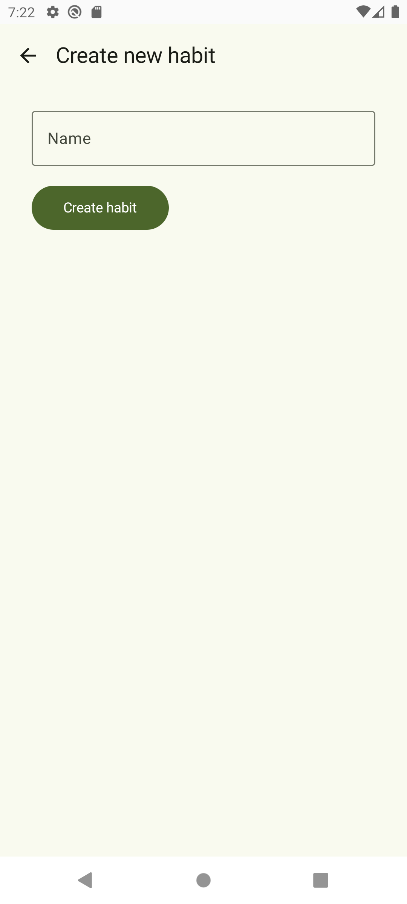
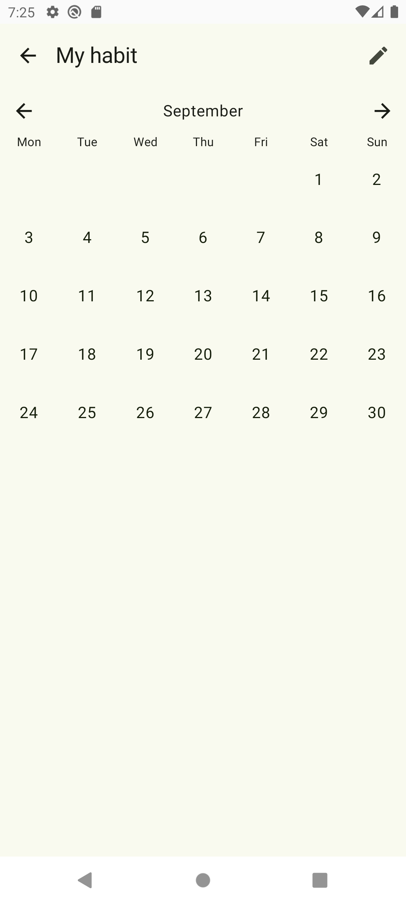

# Habit Watcher
## Описание
Приложение для отслеживания прогресса привычек
## Стек технологий
* Kotlin
* Single Activity
* Jetpack Compose
* Decompose
* MVVM (на основе Decompose)
* Kotlin coroutines
* Kotlin Serialization
* Room
## Скриншоты
### Пустой список привычек

### Список привычек

### Добавление новой привычкип

### Детали привычки

